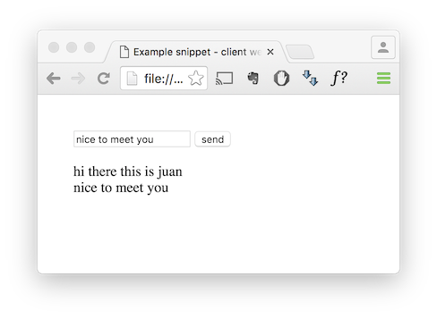
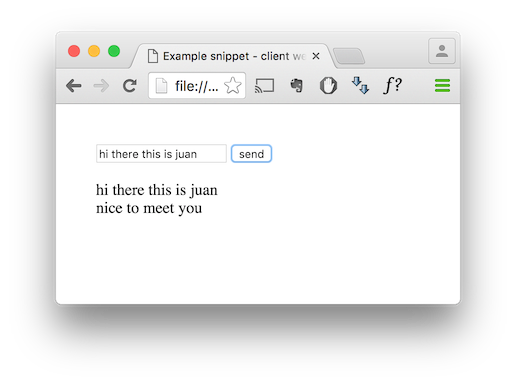
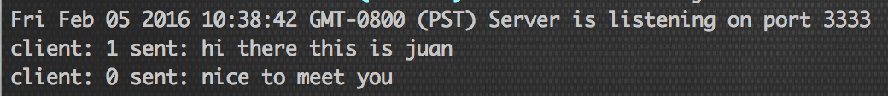

# node_websocket
Easy example to get started on using websockets with node.

Simple client and server communication, with a chat example.
 


## Installation
1. Clone the project repository: ``` git clone https://github.com/jgrecoarroyo/node_websocket.git```
2. Install the project dependencies: ```npm install```
3. Run the websockets server: ```node bin/server.js```

## Usage
Once the websockets server is running, you should see something like: ```Server is listening on port 3333``` Double check that you are not running other services on this same port, or change the port number to your favourite.

Open the file [client.html](https://github.com/jgrecoarroyo/node_websocket/blob/master/bin/client.html) on your browser (note, the websocket server is not hosting this client.html file; this is kept like this on purpose to only show the code needed for the websocket server).

## Contributing
1. Fork it!
2. Create your feature branch: `git checkout -b my-new-feature`
3. Commit your changes: `git commit -am 'Add some feature'`
4. Push to the branch: `git push origin my-new-feature`
5. Submit a pull request :D


## Credits
Base on [Michael's tutorial](http://codular.com/node-web-sockets)

## License
The MIT License (MIT) see [LICENSE](https://github.com/jgrecoarroyo/node_websocket/blob/master/LICENSE)